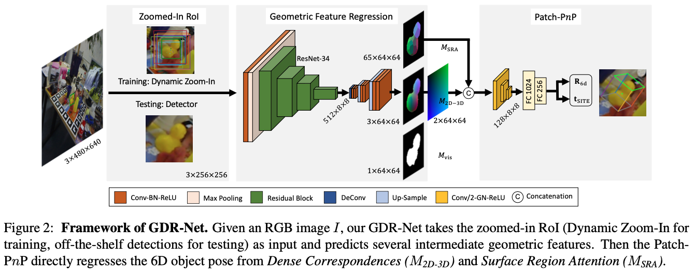

# GDR-Net
This repo provides the PyTorch implementation of the work:

**Gu Wang, Fabian Manhardt, Federico Tombari, Xiangyang Ji. GDR-Net: Geometry-Guided Direct Regression Network for Monocular 6D Object Pose Estimation. In CVPR 2021.**
[[ArXiv](http://arxiv.org/abs/2102.12145)][[bibtex](#Citation)]


## Overview
<p align="center">

<p>


## Requirements
* Ubuntu 16.04/18.04, CUDA 10.1/10.2, python >= 3.6, PyTorch >= 1.6, torchvision
* Install `detectron2` from [source](https://github.com/facebookresearch/detectron2)
* `sh scripts/install_deps.sh`
* Compile the cpp extension for `farthest points sampling (fps)`:
    ```
    sh core/csrc/compile.sh
    ```

## Datasets
Download the 6D pose datasets (LM, LM-O, YCB-V) from the
[BOP website](https://bop.felk.cvut.cz/datasets/) and
[VOC 2012](https://pjreddie.com/projects/pascal-voc-dataset-mirror/)
for background images.
Please also download the `image_sets` and `test_bboxes` from
here ([BaiduNetDisk](https://pan.baidu.com/s/1gGoZGkuMYxhU9LBKxuSz0g), [OneDrive](https://1drv.ms/u/s!Ah83ZdJvIaBnnjqVy9Eyn0yxDb8i?e=0Q3qRU), password: qjfk).

The structure of `datasets` folder should look like below:
```
# recommend using soft links (ln -sf)
datasets/
├── BOP_DATASETS
    ├──lm
    ├──lmo
    ├──ycbv
├── lm_imgn  # the OpenGL rendered images for LM, 1k/obj
├── lm_renders_blender  # the Blender rendered images for LM, 10k/obj (pvnet-rendering)
├── VOCdevkit
```

* `lm_imgn` comes from [DeepIM](https://github.com/liyi14/mx-DeepIM), which can be downloaded here ([BaiduNetDisk](https://pan.baidu.com/s/1e9SJoqb0EmyqVLEVlbNQIA), [OneDrive](https://1drv.ms/u/s!Ah83ZdJvIaBnoEz5BM4Ho6_W_UUA?e=pj7Y7i), password: vr0i).

* `lm_renders_blender` comes from [pvnet-rendering](https://github.com/zju3dv/pvnet-rendering), note that we do not need the fused data.


## Training GDR-Net
`./core/gdrn_modeling/train_gdrn.sh <config_path> <gpu_ids> (other args)`

Example:
```
./core/gdrn_modeling/train_gdrn.sh configs/gdrn/lm/a6_cPnP_lm13.py 0  # multiple gpus: 0,1,2,3
# add --resume if you want to resume from an interrupted experiment.
```


Our trained GDR-Net models can be found here ([BaiduNetDisk](https://pan.baidu.com/s/1_MEZJBd67hdxcE8JzmnOtA), [OneDrive](kedv), password: kedv). <br />
<sub><sup>(Note that the models for BOP setup in the supplement were trained using a refactored version of this repo (not compatible), they are slightly better than the models provided here.)</sup></sub>


## Evaluation
`./core/gdrn_modeling/test_gdrn.sh <config_path> <gpu_ids> <ckpt_path> (other args)`

Example:
```
./core/gdrn_modeling/test_gdrn.sh configs/gdrn/lmo/a6_cPnP_AugAAETrunc_BG0.5_lmo_real_pbr0.1_40e.py 0 output/gdrn/lmo/a6_cPnP_AugAAETrunc_BG0.5_lmo_real_pbr0.1_40e/gdrn_lmo_real_pbr.pth
```


## Citation
If you find this useful in your research, please consider citing:
```
@InProceedings{Wang_2021_GDRN,
    title = {{GDR-Net}: Geometry-Guided Direct Regression Network for Monocular 6D Object Pose Estimation},
    author = {Wang, Gu and Manhardt, Fabian and Tombari, Federico and Ji, Xiangyang},
    booktitle = {IEEE/CVF Conference on Computer Vision and Pattern Recognition (CVPR)},
    month = {June},
    year = {2021}
}
```
